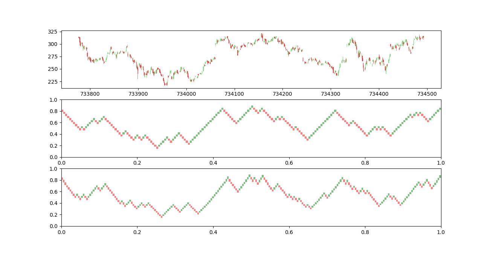
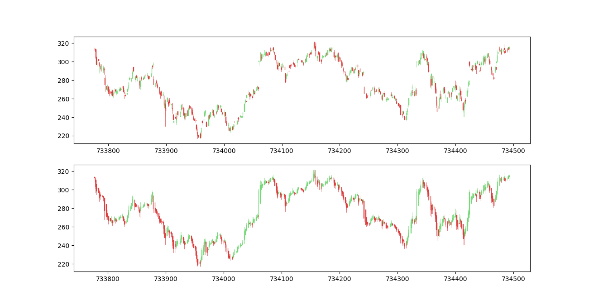

# fx-charts

A python utility to build Renko bricks and Heikin Ashi candlesticks.

# Renko bricks



There are two ways to build the bricks:

| Type | Description |
| --- | --- |
| fixed | The Renko bricks are build as a fixed amount, this is, for each 5$ of increase or decrease in the price a new brick is built |
| percentage | The Renko bricks are build based on a percentage, this is, if this parameter is set to 0.02 (2%) and the price increase (or decrease) 2%, a new brick is built |
| atr | The Renko bricks are build based on the average true value (ATR). For every candlestick, the ATR is computed and then this values is used to determine if it is need to create another brick or not |

#### Usage

```python
from fxcharts import renko

ohlc = pd.read_csv(...)

# renko with based on value
bricks_fixed = renko(ohlc["close"], fixed=5)

# renko with based on percentage
bricks_percentage = renko(ohlc["close"], percentage=0.02)

# renko with based on average true range
bricks_atr = renko(ohlc["close"], atr=14)
```
# Heikin Ashi candlesticks



This functions returns an dict with open, high, low and close prices for Heikin Ashi indicator.

#### Usage

```python
from fxcharts import ha_candlesticks

ohlc = pd.read_csv(...)

ha_bars = ha_candlesticks(ohlc)
```